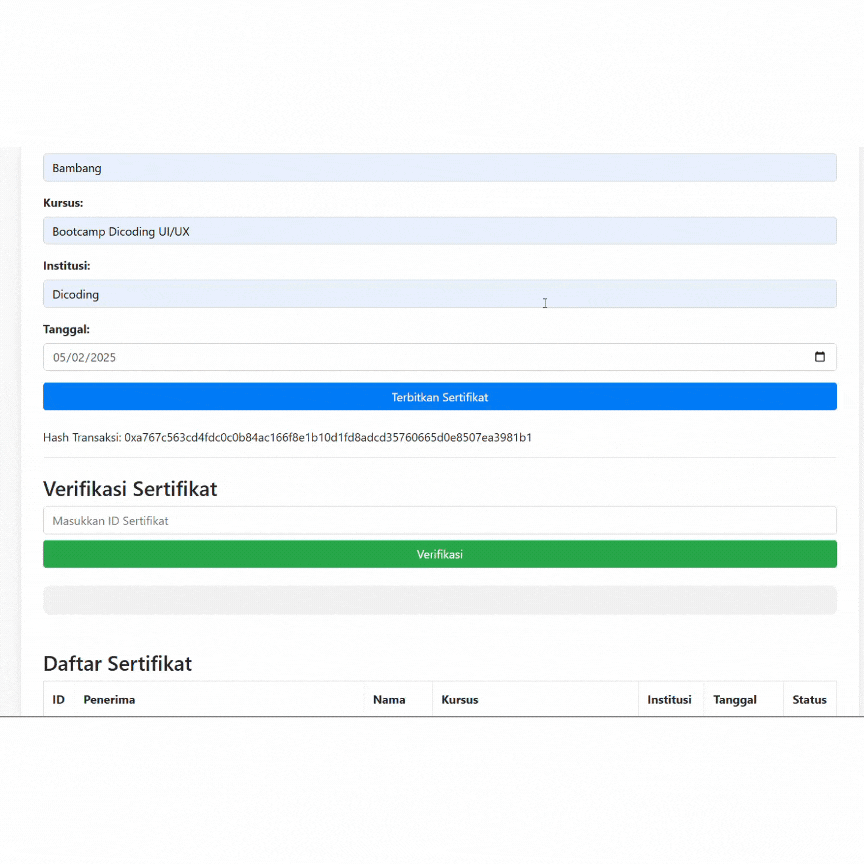

# 📜 Aplikasi Sertifikat Blockchain

## 📌 Tentang Aplikasi
Aplikasi ini memungkinkan pengguna untuk menerbitkan dan memverifikasi sertifikat berbasis blockchain. Dengan memanfaatkan teknologi smart contract, setiap sertifikat yang diterbitkan akan tersimpan di blockchain, memastikan keaslian dan keamanan data.

## 🚀 Fitur Aplikasi
- **Penerbitan Sertifikat**: Admin dapat menerbitkan sertifikat baru dengan memasukkan data penerima.
- **Verifikasi Sertifikat**: Pengguna dapat memverifikasi sertifikat berdasarkan ID.
- **Daftar Sertifikat**: Menampilkan semua sertifikat yang telah diterbitkan.

## 🎥 Tutorial Penggunaan

### 1️⃣ Penerbitan Sertifikat


### 2️⃣ Verifikasi Sertifikat


### 3️⃣ Menampilkan Daftar Sertifikat


## ⚙️ Teknologi yang Digunakan
- **Solidity**: Smart contract
- **Web3.js**: Integrasi dengan blockchain
- **Bootstrap**: UI styling
- **MetaMask**: Wallet Ethereum

## 📥 Instalasi & Penggunaan
1. Clone repository ini:
   ```sh
   git clone https://github.com/HamamPriyatmoko/sertifikat_blockchain.git
   ```
2. Jalankan server dan pastikan memiliki MetaMask terhubung.
3. Deploy smart contract di jaringan blockchain.
4. Jalankan aplikasi dengan membuka file `index.html`.

---

📧 **Kontak Developer**
Jika ada pertanyaan atau ingin berkontribusi, silakan hubungi [hamampriyatmoko81@gmail.com](mailto:hamampriyatmoko81@gmail.com).

